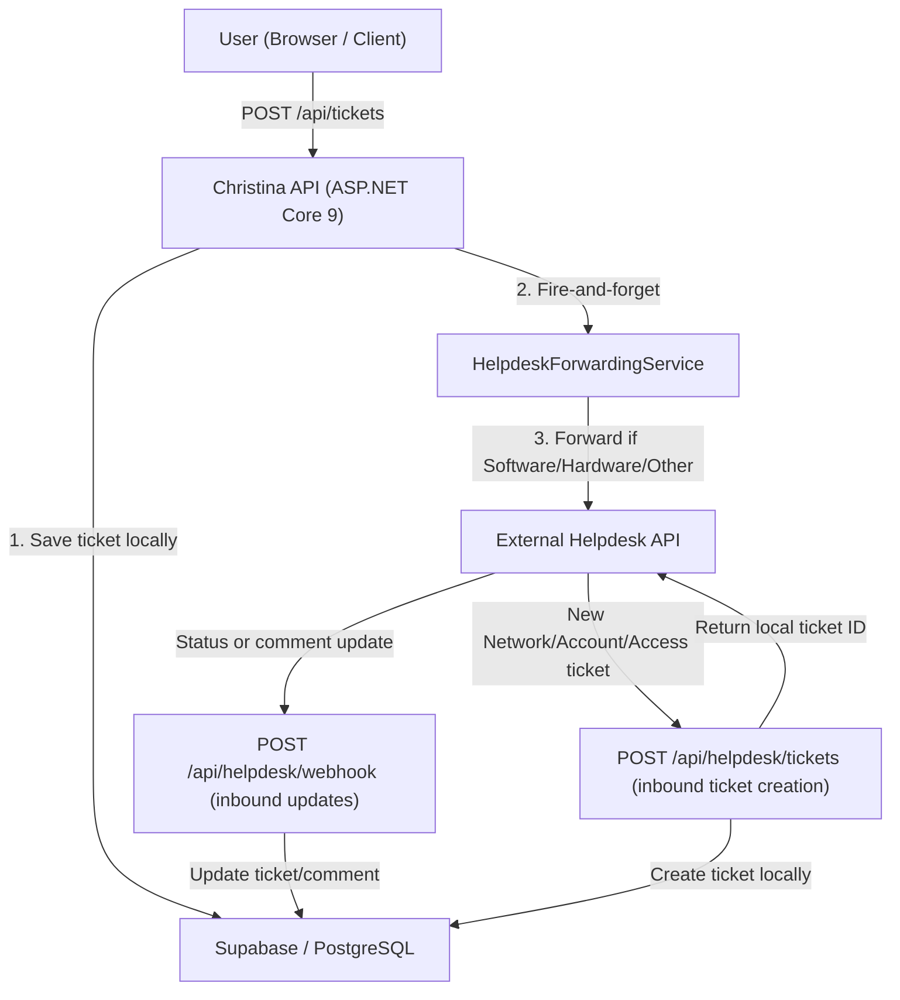
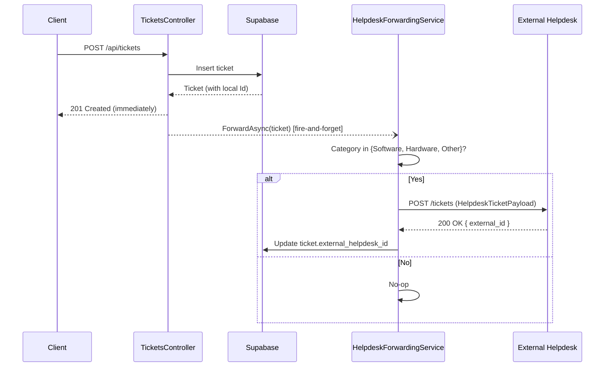
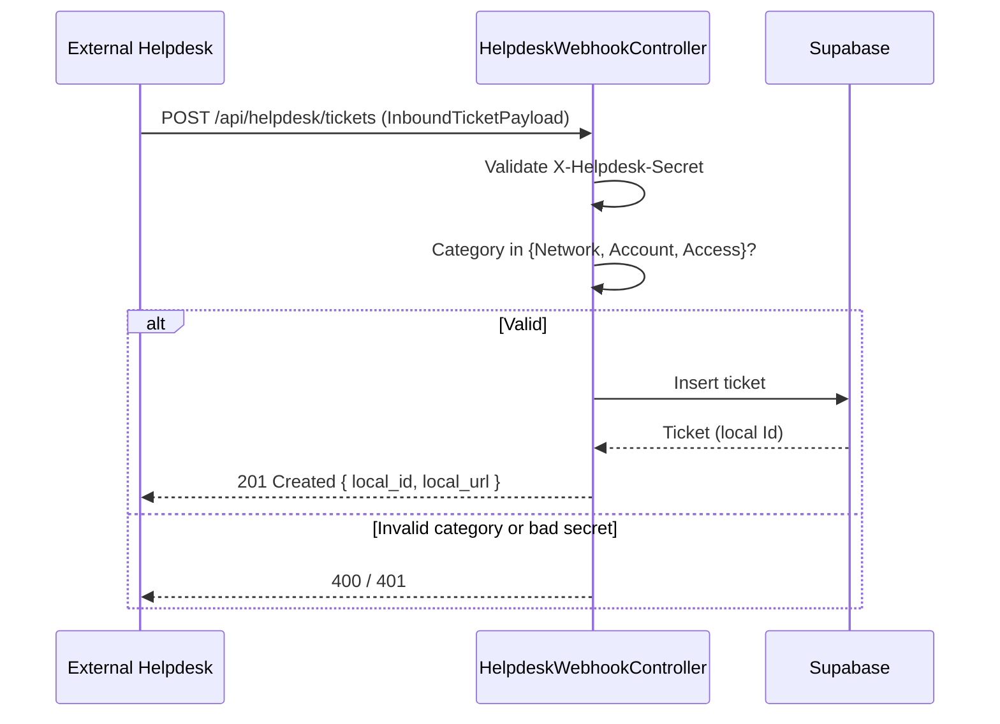
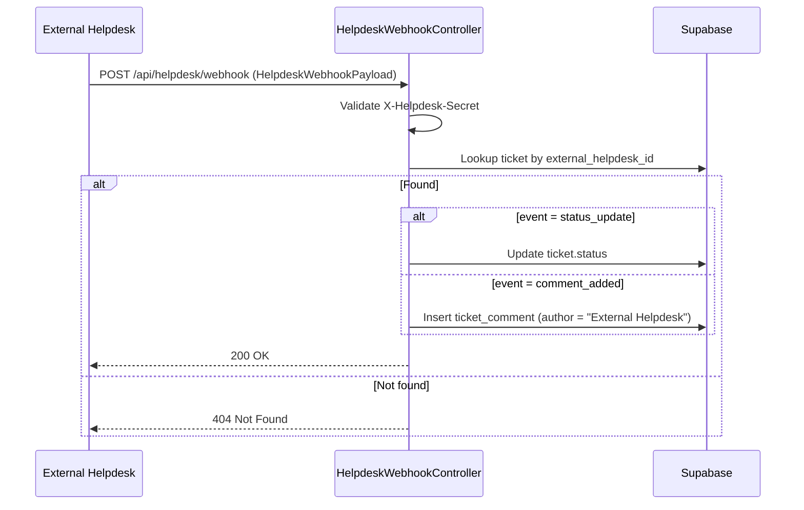

# Design Document: External Helpdesk Integration

## Overview

This feature connects Christina's Ticketing System with an external helpdesk system. The integration is bidirectional:

- **Outbound**: Tickets created in Christina's system with categories Software, Hardware, or Other are automatically forwarded to the external helpdesk after local save.
- **Inbound**: The external helpdesk can push tickets with categories Network, Account, or Access into Christina's system for local handling.
- **Sync**: Status and comment updates flow both ways via webhooks.

Christina's system is always the user-facing entry point. No existing endpoints or behavior change.

---

## Category Routing

| Category | Handled By         | Direction         |
|----------|--------------------|-------------------|
| Software | External Helpdesk  | Outbound forward  |
| Hardware | External Helpdesk  | Outbound forward  |
| Other    | External Helpdesk  | Outbound forward  |
| Network  | Christina's System | Inbound receive   |
| Account  | Christina's System | Inbound receive   |
| Access   | Christina's System | Inbound receive   |

---

## Architecture



---

## Sequence Diagrams

### Outbound: Ticket Created in Christina's System



### Inbound: External System Creates a Ticket in Christina's System



### Inbound: Status or Comment Update from External System



---

## API Endpoints (What to Share with the External Team)

### Base URL (Production)
```
https://<your-railway-domain>
```
> Replace with your actual Railway URL once deployed.

### Endpoint 1 — Create a ticket in Christina's system
```
POST /api/helpdesk/tickets
```

### Endpoint 2 — Push a status or comment update
```
POST /api/helpdesk/webhook
```

Both endpoints require the header:
```
X-Helpdesk-Secret: <shared_secret>
```

---

## Payload Specifications

### Outbound: Christina → External Helpdesk

**POST to external system when forwarding a ticket**

```json
{
  "local_id": 42,
  "title": "Laptop not booting",
  "description": "The laptop shows a black screen on startup.",
  "category": "Hardware",
  "priority": "High",
  "created_by": "jane.doe",
  "created_date": "2025-03-26T10:00:00Z",
  "callback_webhook_url": "https://<your-railway-domain>/api/helpdesk/webhook",
  "callback_secret": "<shared_secret>"
}
```

**Expected response from external system:**
```json
{
  "external_id": "EXT-1234"
}
```

---

### Inbound: External Helpdesk → Christina (Create Ticket)

**POST /api/helpdesk/tickets**

```json
{
  "external_id": "EXT-5678",
  "title": "User cannot access VPN",
  "description": "User reports VPN connection drops every 5 minutes.",
  "category": "Network",
  "priority": "Medium",
  "created_by": "helpdesk.agent@external.com",
  "created_date": "2025-03-26T11:00:00Z"
}
```

Valid categories for inbound: `Network`, `Account`, `Access`

**Response from Christina's system:**
```json
{
  "local_id": 99,
  "local_url": "https://<your-railway-domain>/api/tickets/99"
}
```

---

### Inbound: External Helpdesk → Christina (Status or Comment Update)

**POST /api/helpdesk/webhook**

**Status update:**
```json
{
  "external_id": "EXT-1234",
  "event_type": "status_update",
  "new_status": "in_progress",
  "timestamp": "2025-03-26T12:00:00Z"
}
```

**Comment added:**
```json
{
  "external_id": "EXT-1234",
  "event_type": "comment_added",
  "comment_author": "John Tech",
  "comment_message": "We have identified the issue and are working on a fix.",
  "timestamp": "2025-03-26T12:30:00Z"
}
```

**Valid `event_type` values:** `status_update`, `comment_added`

**Valid `new_status` values:**

| External Value  | Christina Status  |
|-----------------|-------------------|
| `open`          | Open              |
| `in_progress`   | InProgress        |
| `waiting`       | WaitingForUser    |
| `resolved`      | Resolved          |
| `closed`        | Closed            |

---

## New Database Column

Run this in Supabase SQL Editor:

```sql
alter table tickets
    add column if not exists external_helpdesk_id text null,
    add column if not exists external_source text null;
```

- `external_helpdesk_id` — ID assigned by the external system (null if not forwarded/received)
- `external_source` — `"outbound"` (forwarded by us) or `"inbound"` (created by them)

---

## New Configuration (appsettings.json)

```json
"ExternalHelpdesk": {
  "BaseUrl": "",
  "ApiKey": "",
  "WebhookSecret": "",
  "ForwardCategories": ["Software", "Hardware", "Other"],
  "InboundCategories": ["Network", "Account", "Access"],
  "TimeoutSeconds": 10
}
```

All values injected via Railway environment variables in production.

---

## Error Handling

| Scenario | Behaviour |
|---|---|
| Forwarding fails (external API down) | Logged, swallowed — ticket still created locally |
| Bad webhook secret | 401 Unauthorized |
| Unknown external_id on webhook | 404 Not Found |
| Invalid category on inbound ticket | 400 Bad Request |
| Unknown event_type on webhook | 400 Bad Request |
| Unknown status value | Logged, no update applied |
